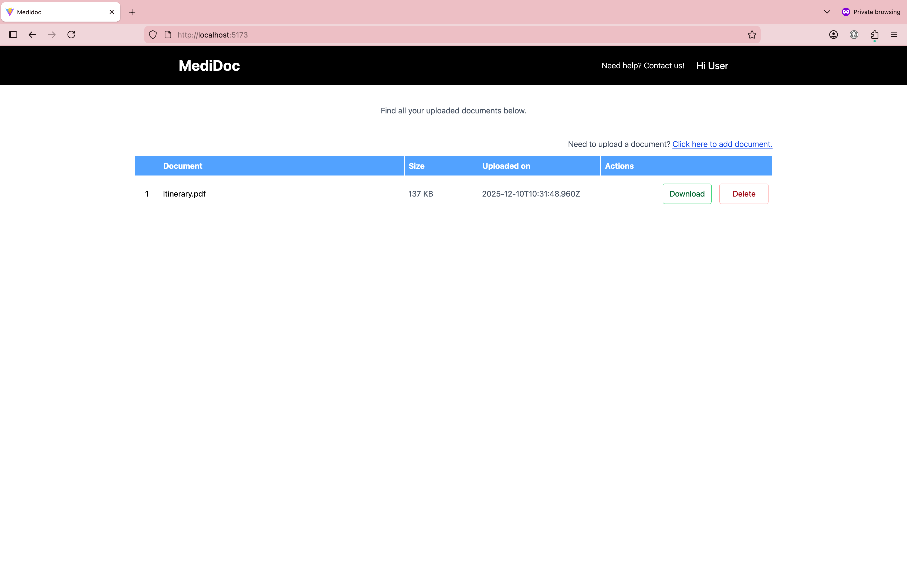

# MediDoc

This is a simple full-stack application built for a healthcare platform that allows patients to upload, view, download, and delete their medical documents (PDFs).

The app focuses on frontend development, backend APIs, file handling, and basic database operations.

The system consists of:
    A React frontend where users can upload and manage PDF documents.
    An Express.js backend that exposes REST APIs for file operations.
    A SQLite database that stores metadata about uploaded files.
    A local uploads folder where the actual PDF files are stored.

This application runs locally and assumes a single user for simplicity (no authentication required).

    1. Frontend
        ● Upload PDF file (with validation)
        ● Show uploaded files in a list
        ● Allow download and deletion

    2. Backend
        ● Store files locally in uploads folder
        ● Store metadata in a database Sqlite
        ● Handle all endpoints
        
    3. Database
        ● A simple table documents with fields:
            ○ id, filename, filepath, filesize, created_at
        

# Setup and Installations
    Run the application locally. Follw the below steps to setup:

    1. Clone the Repository
        git clone https://github.com/anshu-intern/medidoc.git
        cd medidoc

    2. Navigate to the Backend
        cd backend

    3. Install dependencies
        npm install

    4. Add env variables
        touch .env
        add PORT=8080 ,ENVIRONMENT=DEVELOPMENT to the file and save it.

    5. Start the backend
        npm run dev

        This will start the backend server at: http://localhost:8080

    6. Navigate into frontend folder
        cd ../frontend

    7. Install dependencies
        npm install

    8. Start the frontend
        npm run dev

        This will start the frontend at: http://localhost:5173

    9. Open the App
        Open your browser and go to: http://localhost:5173

# Sample API calls

