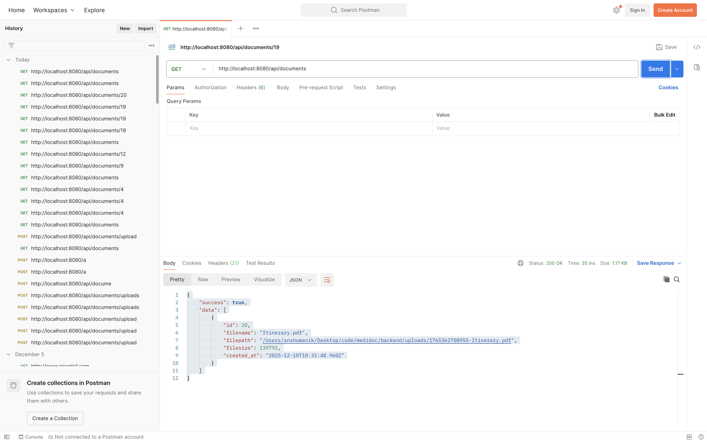
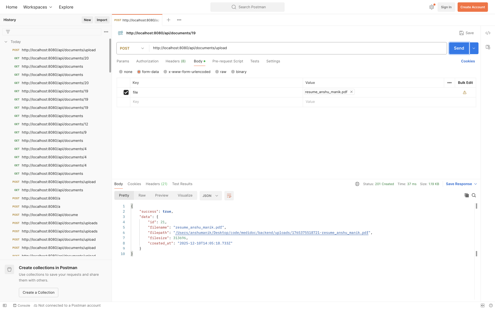
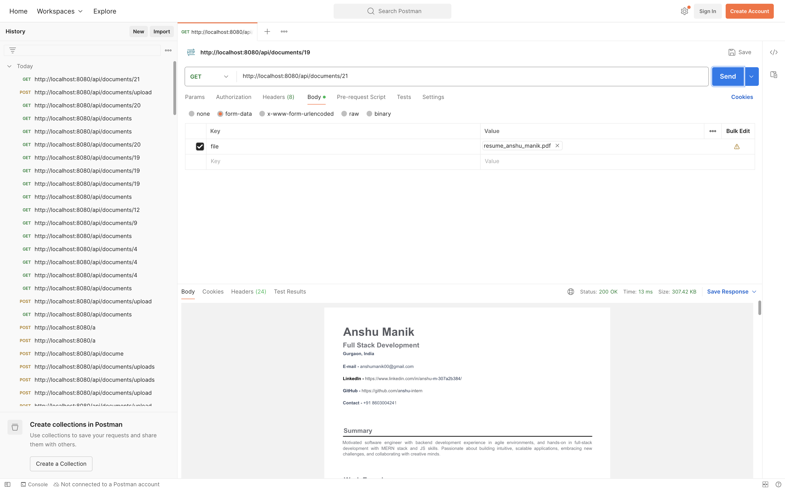

1. Tech Stack Choices

Q1. What frontend framework did you use and why? (React, Vue, etc.)

    I chose React as my frontend framework because it is component-based, making it easy to build reusable elements. Its virtual DOM ensures efficient updates, which improves performance, especially in dynamic applications. 
    I paired React with Vite for development because Vite provides a fast, modern build tool with instant server start and hot module replacement. Additionally, I used React Router DOM to handle routing, allowing smooth navigation between different pages without full page reloads.
    For API calls at frontend, I used axios as it simplifies HTTP requests, supports promises, and allows easy handling of responses and errors.

Q2. What backend framework did you choose and why? (Express, Flask, Django, etc.)

    I chose Express.js as my backend framework because it is lightweight, flexible, and has middleware support, which makes building RESTful APIs efficient. Also it is JavaScript compatible helping me to use JavaScript both in frontend as well as backend. For security and performance, I included middleware like helmet for HTTP headers, hpp to prevent HTTP parameter pollution, cors for cross-origin requests, and compression to reduce response sizes and for file handling, I use multer.

Q3. What database did you choose and why? (SQLite vs PostgreSQL vs others)

    I chose SQLite because it is simple, serverless, and easy to integrate for small to medium-scale applications. This combination allowd me to quickly build a secure, performant, and maintainable backend.
    For larger-scale applications, I would consider PostgreSQL or MySQL for their advanced features and scalability.

Q4. If you were to support 1,000 users, what changes would you consider?

    If I were to support 1,000 users, I would make the following changes:
    a. create a separate repo for backend and frontend
    b. Use more advanced database like PostgresSQL or cloud DB considering horizontal and vertical scaling and high availablity
    c. Implement rate limiting, idempotency, user traffic at backend server to handle backend load
    d. Implement caching methodologies like redis for faster db queries and also implement queueing using bullmq or similar tool
    e. Implement authentication and authorisation and admin analytics features

2. Architecture Overview

    2.1. Draw or describe the flow between frontend, backend, database, and file storage.
        
        [React Frontend]  <--->  [Express Backend]  <--->  [Database (SQLite)]
                                    |
                                    v
                                [File Storage (local)]

    Flow explanation:
    The frontend (React) sends API requests to the backend via HTTP (using Axios).
    The backend (Express) handles the request and 
        Query or update the database (SQLite)
        Upload/download files from file storage (local folder)
    The backend sends the processed data back to the frontend.

3. API Specification
    For each of the following endpoints, provide:
    ● URL and HTTP method
    ● Sample request & response
    ● Brief description

    Endpoint            Method       URL                                            Description
    /documents/upload   POST         http://localhost:8080/api/documents/upload     Upload a PDF- 
                                                                                    PDF is sent as multipart/form-data to the backend 
                                                                                    and is processed and stored locally     

    /documents          GET          http://localhost:8080/api/documents/           List all documents present 
                                                                                    in the database, with metadata

    /documents/:id      GET          http://localhost:8080/api/documents/19         Download a file -
                                                                                    Get file data for download based on id

    /documents/:id      DELETE       http://localhost:8080/api/documents/19         Delete a file -
                                                                                    Delete a file from db and storage with the help of file id

    Sample API ENDPOINT calls

    
    
    
    

4. Data Flow Description

Q5. Describe the step-by-step process of what happens when a file is uploaded and when it is
downloaded.

    File Upload Flow
        1. User selects a PDF file on the frontend
            When click “Upload,” React sends the file to the backend using Axios with multipart/form-data.

        2. Frontend sends a POST request
            POST /documents/upload
            Content-Type: multipart/form-data
            The file is included as file.
            Axios sends the request to Express backend.

        3. Express receives the request
            Express is continously listining for any request.
            It receives the request and routes it to the defined route
            The request is processed by the middlewares
            Middleware  (multer) parses the file from the request.
            Security middleware like helmet, cors, hpp runs first.
            Multer stores the file in disk and request is moved to the controller logic

        4. Backend stores the file
            The file metadata is saved to database (uploads folder).
            Backend writes metadata to the database
            A new row is inserted into SQLite:
                ID
                filename
                size
                upload timestamp

        6. Backend responds to the frontend
        Response is sent to frontend for the processed request to 
        the frontend

        File Download Flow
        1. User clicks “Download”
            The frontend calls GET /documents/:id with blob request

        2. Backend receives request
            Request is routed to the respective route
            Express extracts id from the URL params.
            The backend queries the database with the id for the requested file

        3. Backend locates the file in storage If not found, return 404.

        4. Backend streams the file to the user
            Sets headers:
            Content-Type: application/pdf
            Content-Disposition: attachment; filename="report.pdf"
            Sends file as a binary stream as a blob

        5. Browser receives the file
            browser receives the file as a blob
            The code converts the response to a temporary browser file
            We Extract the filename from Content-Disposition response header
            Programmatically we trigger a browser download
            The code creates a hidden <a> element and clicks it
            The browser automatically downloads it.
            Cleanup - Remove the temporary URL to avoid memory leaks

5. Assumptions

Q6. What assumptions did you make while building this? (e.g., file size limits, authentication,
concurrency)

Assumptions made are:
1. Assumed a single user for simplicity
2. Assumed the user uploads only small files
3. Assumed user uploads only pdf files without any malicious code or virus
4. Assumed single or limited requests - low rate of requests and unique requests per user-non concurrent
5. Assumed local system users
6. Assumed small scale environment
7. Assumed development environment
8. Assumed simple logic flow for UnitTest and validations
9. Assumed non technical users and stake holders for application usage
10. Assumed a limited number of file uploads for a user
11. Assumed good network bandwidth/local network
12. Assumed secured network connection
13. Assumed responsible and ethical users and system users
14. Assumed simple browser environment for application compatibality
15. Assumed low db queries and overheads
16. Assumed valid endpoint requests and url routes
17. Assumed simple business logic and simple file/folder structure